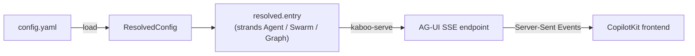

# Concepts

A mental model for how kaboo-workflows turns a YAML file into a running,
streaming multi-agent system.

## `load()` returns plain strands objects

kaboo-workflows is a **resolver**, not a runtime wrapper. `load(config)` reads
your YAML, resolves every reference, and returns live
[strands-agents](https://github.com/strands-agents/harness-sdk) objects —
`strands.Agent`, `Swarm`, `Graph` — with nothing wrapping them. Whatever you can
do with a hand-built strands object, you can do with the one kaboo hands back.



## The pieces

A config wires together a handful of resolvable sections (each has its own
chapter in the [Configuration reference](configuration/README.md)):

| Section | What it is |
|---------|-----------|
| `models` | Named model providers (`bedrock`, `openai`, `ollama`, `gemini`). |
| `agents` | Named agents: a model, a system prompt, tools, hooks and MCP clients. |
| `mcp_servers` | MCP servers the library starts and stops for you. |
| `mcp_clients` | Connections to MCP servers, which agents attach by name. |
| `orchestrations` | How agents compose into a multi-agent system. |
| `attachments` | How references (files + custom entities cited via `@`) reach agents. |
| `session_manager` | Where conversation state persists between runs. |
| `entry` | The root agent or orchestration a run starts from. **The only required key.** |

Tools and hooks are not top-level sections — they are declared per agent, as
`agents.<name>.tools` and `agents.<name>.hooks`. Tools are Python `@tool`
functions loaded from files or modules, plus built-ins like `ask_user`; hooks are
lifecycle callbacks for event publishing, interrupts and guards. The remaining
root keys are settings rather than wiring: `history`, `telemetry`, `runtime`,
`log_level` and `version`, plus `vars` for interpolation.

## Orchestration shapes

Agents compose through orchestrations, which nest arbitrarily:

- **delegate** — an entry agent calls other agents as tools (see
  [deep nesting](workflows/deep-nesting.md)).
- **swarm** — agents hand off to one another until one produces the answer.
- **graph** — an explicit DAG of agents with edges and an entry point.

Those three are the whole list — `mode:` accepts nothing else. Two patterns
people look for as modes are properties of a graph rather than shapes of their
own:

- **parallel** — a graph node with several outgoing edges fans out, and the
  branches run concurrently (see [parallel](workflows/parallel.md)).
- **nested** — any orchestration can be a node inside another (see
  [swarm + graph](workflows/swarm-and-graph.md)).

## Serving: the AG-UI event stream

`kaboo-serve` (or `create_agui_app` in `kaboo_workflows.adapters`) wraps the
resolved entry with [ag-ui-strands](https://github.com/ag-ui-protocol/ag-ui) and
exposes it as an AG-UI SSE endpoint. A single run emits a well-formed event
stream:

```text
RUN_STARTED → TEXT_MESSAGE_* → TOOL_CALL_* → ACTIVITY_SNAPSHOT → RUN_FINISHED
```

`ACTIVITY_SNAPSHOT` events carry the hierarchical activity tree that
[kaboo-react](https://github.com/gl-pgege/kaboo-react) renders, while
[kaboo-runtime](https://github.com/gl-pgege/kaboo-runtime) can persist and
replay the whole stream. Human-in-the-loop pauses surface as interrupts on
`RUN_FINISHED` and resume cleanly — see
[human-in-the-loop](workflows/human-in-the-loop.md).

## References & attachments

Anything a user cites from the frontend with `@` — an uploaded file or a pointer
to a custom entity (a table, a dashboard) — is a **reference**. The AG-UI layer
gives inline media to the entry agent automatically; the `attachments:` config
extends that to any agent in a pipeline via a lightweight **manifest**, an
on-demand **tool** (`fetch_attachment` / `list_references`), and opt-in
**inline** `ContentBlock`s for vision/doc-capable models. File attachments are
resolved by the built-in tool; custom object kinds are resolved by your own MCP
tool. See [Attachments & Multimodal](configuration/Chapter_19.md).

Attachment URL fetches funnel through a pluggable fetcher: configure
`attachments.base_url` / `authorization` for files behind your API's auth, or
register a `ReferenceFetcher` in code for multi-store routing.

## The host side channel: `forwardedProps`

The AG-UI protocol carries a free-form `forwardedProps` object on every run —
context the *host backend* sends the runtime that is not part of the
conversation and never reaches the model as text: run-scoped credentials,
tenant ids, per-run agent configuration. kaboo binds it per request; your
tools and hooks read it back with `get_forwarded_props()`, and every agent
also receives a copy in its state under `forwarded_props`.

Two built-in features consume it:

- **Authorized attachment fetching** — `attachments.authorization: forwarded_props:<key>`
  reads a run-scoped bearer token for own-origin fetches.
- **Runtime-submitted workflow configs** — with
  `create_agui_app(session_config_key="workflow_config")`, the run's own YAML
  arrives under that key and is merged over the service's base config. This is how
  one process serves many host-defined agent types: each run gets its own agents,
  orchestration, entry and MCP client sessions, and editing an agent type takes
  effect on the next turn without a restart. See
  [Chapter 13](configuration/Chapter_13.md#the-second-merge-mode-session-overlays).

  A submitted config supersedes `forwardedProps.agent_config`, which applied only
  `system_prompt` and `model_id` behind `runtime.allow_invocation_overrides`. That
  flag is **deprecated**: an overlay expresses both, plus the structure they could
  not.

Everything on this channel is only as trustworthy as whoever set it, so a host
should stamp these server-side rather than accept them from a browser — see
[server-side props](https://gl-pgege.github.io/kaboo-runtime/server-side-props/)
in kaboo-runtime for where that goes on a Node host.

## Statelessness: what a run keeps and what it carries

A run keeps nothing. Everything a conversation accumulates arrives with the turn
on the AG-UI **state channel** — `kaboo_history` for sub-agent transcripts,
`kaboo_session` for a pending human-in-the-loop gate — and leaves in the outgoing
`STATE_SNAPSHOT` the host persists.

That is what makes the rest safe: a service can rebuild its agents every run,
scale to a second replica, or restart mid-approval, and behave identically,
because the objects being rebuilt hold behaviour rather than memory.

## Where to go next

- **[Getting started](getting-started.md)** if you haven't run it yet.
- **[Configuration reference](configuration/README.md)** for the exhaustive
  option list.
- **[Troubleshooting](troubleshooting.md)** when something doesn't resolve.
