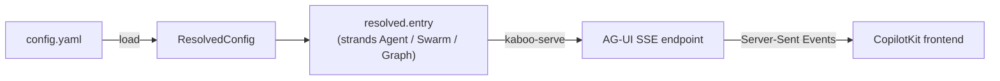

# Concepts

A mental model for how kaboo-workflows turns a YAML file into a running,
streaming multi-agent system.

## `load()` returns plain strands objects

kaboo-workflows is a **resolver**, not a runtime wrapper. `load(config)` reads
your YAML, resolves every reference, and returns live
[strands-agents](https://github.com/strands-agents/harness-sdk) objects —
`strands.Agent`, `Swarm`, `Graph` — with nothing wrapping them. Whatever you can
do with a hand-built strands object, you can do with the one kaboo hands back.



## The pieces

A config wires together a handful of resolvable sections (each has its own
chapter in the [Configuration reference](configuration/README.md)):

| Section | What it is |
|---------|-----------|
| `models` | Named model providers (`openai`, `ollama`, `gemini`, Bedrock, …). |
| `agents` | Named agents: a model, a system prompt, tools, and hooks. |
| `tools` | Python `@tool` functions loaded from files, plus built-ins like `ask_user`. |
| `hooks` | Lifecycle hooks — event publishing, interrupts/HITL, guards. |
| `mcp` | Model Context Protocol servers/clients, lifecycle-managed for you. |
| `orchestrations` | How agents compose into a multi-agent system. |
| `entry` | The root agent or orchestration a run starts from. |

## Orchestration shapes

Agents compose through orchestrations, which nest arbitrarily:

- **delegate** — an entry agent calls other agents as tools (see
  [deep nesting](workflows/deep-nesting.md)).
- **swarm** — agents hand off to one another until one produces the answer.
- **graph** — an explicit DAG of agents with edges and an entry point.
- **parallel** — fan out to several branches and merge (see
  [parallel](workflows/parallel.md)).
- **nested** — any orchestration can be a node inside another (see
  [swarm + graph](workflows/swarm-and-graph.md)).

## Serving: the AG-UI event stream

`kaboo-serve` (or `create_agui_app` in `kaboo_workflows.adapters`) wraps the
resolved entry with [ag-ui-strands](https://github.com/ag-ui-protocol/ag-ui) and
exposes it as an AG-UI SSE endpoint. A single run emits a well-formed event
stream:

```text
RUN_STARTED → TEXT_MESSAGE_* → TOOL_CALL_* → ACTIVITY_SNAPSHOT → RUN_FINISHED
```

`ACTIVITY_SNAPSHOT` events carry the hierarchical activity tree that
[kaboo-react](https://github.com/gl-pgege/kaboo-react) renders, while
[kaboo-runtime](https://github.com/gl-pgege/kaboo-runtime) can persist and
replay the whole stream. Human-in-the-loop pauses surface as interrupts on
`RUN_FINISHED` and resume cleanly — see
[human-in-the-loop](workflows/human-in-the-loop.md).

## Where to go next

- **[Getting started](getting-started.md)** if you haven't run it yet.
- **[Configuration reference](configuration/README.md)** for the exhaustive
  option list.
- **[Troubleshooting](troubleshooting.md)** when something doesn't resolve.
