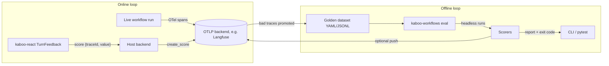

# Evaluation

kaboo-workflows treats evaluation as a first-class, opt-in feature with two
loops:

- **Online**: live runs emit OpenTelemetry traces (agent → cycle → model →
  tool spans, with tokens and cost) to any OTLP backend. User feedback from the
  UI attaches scores to the exact trace.
- **Offline**: a golden dataset of real questions runs headlessly through the
  *same* wire path as production, and pluggable scorers gate the result with a
  nonzero exit code.

Everything is off by default and zero-overhead when disabled: with telemetry
off, no OTel SDK is configured and all instrumentation is a no-op.



## Online tracing

### Enable telemetry

Add a `telemetry` section to your config:

```yaml
telemetry:
  enabled: true
  service_name: my-agent-service     # OTel service.name (default: kaboo-workflows)
  otlp:
    endpoint: http://localhost:3010/api/public/otel   # traces go to <endpoint>/v1/traces
    headers:                          # or a single "k=v,k2=v2" string
      Authorization: Basic <base64(public:secret)>
      x-langfuse-ingestion-version: "4"
  sample_ratio: 1.0                   # 0..1, trace-id ratio sampling
  console: false                      # also print spans to stdout (debugging)
  trace_attributes:                   # static attributes stamped on every span
    deployment.environment: local
```

Or via environment variables (no config change needed):

| Variable | Effect |
| --- | --- |
| `KABOO_TELEMETRY_ENABLED` | `true`/`false` — overrides `telemetry.enabled` in *both* directions (kill switch) |
| `KABOO_OTLP_ENDPOINT` or `OTEL_EXPORTER_OTLP_ENDPOINT` | OTLP base endpoint |
| `KABOO_OTLP_HEADERS` or `OTEL_EXPORTER_OTLP_HEADERS` | `k=v,k2=v2` header string |

When enabled, kaboo initializes strands' `StrandsTelemetry` (agent, cycle,
model, and tool spans following the GenAI semantic conventions) with a batch
span processor — spans stream out incrementally, nothing buffers per run.
Initialization is process-wide and idempotent; an existing global
`TracerProvider` is respected.

### Conversation attributes

Every span is stamped with the identifiers kaboo already tracks, so traces
correlate 1:1 with what the UI shows:

| Attribute | Source |
| --- | --- |
| `session.id` | AG-UI `threadId` |
| `user.id` | authenticated principal (`sub`/`username` claim), when auth is on |
| `kaboo.run.id` | AG-UI `runId` |
| `kaboo.turn.id` | kaboo's logical turn id (stable across interrupt/resume) |

### Trace id in the event stream

The active trace id rides outward so hosts can attach scores to the exact
trace:

- `AGENT_COMPLETE` events carry `trace_id`;
- activity snapshots expose `traceId` per group and `traceByRun` per run
  (`ACTIVITY_SNAPSHOT` → kaboo-react's `StreamGroup.traceId` /
  `ActivityState.traceByRun`);
- `current_trace_id()` (exported from `kaboo_workflows`) returns the ambient
  trace id, `None` when telemetry is off.

### Langfuse quickstart (reference backend)

Any OTLP backend works; [Langfuse](https://langfuse.com) is the reference
because it adds score APIs, LLM-as-judge evaluators, and annotation queues on
top of the traces. Self-hosted:

1. Run Langfuse v4 (web + worker + ClickHouse + MinIO + Redis, reusing your
   Postgres with a dedicated `langfuse` database).
2. Create an org/project and an API key pair in the UI.
3. Point telemetry at it:

```bash
KABOO_OTLP_ENDPOINT=http://localhost:3010/api/public/otel
KABOO_OTLP_HEADERS="Authorization=Basic $(echo -n pk-lf-…:sk-lf-… | base64),x-langfuse-ingestion-version=4"
KABOO_TELEMETRY_ENABLED=true
```

Traces appear under the project within seconds of a run; `session.id` groups
them per conversation.

### User feedback

kaboo-react ships a `TurnFeedback` component / `useTurnFeedback` hook that
resolves the turn's `traceId` and calls a host-provided `onFeedback` callback
— the library stores nothing. The host backend forwards the payload to the
backend's score API (for Langfuse: `create_score(trace_id=…,
name="user-feedback", value=…)`). See the kaboo-react feedback guide.

## Offline evals

Install the extras you need:

```bash
pip install 'kaboo-workflows[evals]'                 # jsonschema for json_schema scorer
pip install 'kaboo-workflows[evals,eval-deepeval]'   # + DeepEval metrics
pip install 'kaboo-workflows[evals,langfuse]'        # + push experiments to Langfuse
```

### Golden dataset format

YAML (or JSONL, one item per line):

```yaml
name: golden-v1                # dataset name (defaults to the file stem)
config: ./config.yaml          # workflow config, relative to this file
scorers:                       # applied to every item
  - type: budget
    max_cost: 2.0
    max_latency_s: 300
items:
  - id: revenue-q3
    input: "What was total revenue in Q3?"
    expect:                    # item-specific scorers
      - type: contains
        value: ["revenue", "Q3"]
      - type: tool_called
        tool: run_sql
      - type: judge
        rubric: "States the Q3 revenue figure with the currency and cites the source table."
  - id: chart
    input: "Plot monthly signups for 2025"
    expect:
      - type: trajectory
        tools: [sql_analyst, chart_visualizer]
```

Item fields: `id` (defaults to `item-<index>`), `input` (required),
`expect`, `state`, `forwarded_props`, `timeout_s` (default 600),
`metadata`.

Every item is implicitly checked by `run_succeeded` (the run finished without
an error) before any configured scorer.

### Built-in scorers

| Type | Checks | Keys |
| --- | --- | --- |
| `contains` / `not_contains` | substring(s) in the final text | `value`, `case_sensitive` |
| `regex` | pattern matches the final text | `pattern`, `flags` (`imsx`) |
| `tool_called` | a tool ran | `tool`, `agent`, `min_count` |
| `trajectory` | tools appear in order (subsequence) | `tools` |
| `budget` | cost / latency / token caps | `max_cost`, `max_latency_s`, `max_input_tokens`, `max_output_tokens`, `max_total_tokens` |
| `json_schema` | structured output (or text-as-JSON) validates | `schema` |
| `judge` | LLM-as-judge against a rubric | `rubric`, `model`, `threshold` (default 0.7), `name` |
| `deepeval` | any DeepEval metric | `metric`, `threshold`, metric kwargs |

The trajectory includes sub-agent invocations: a delegation or handoff to
`sql_analyst` counts as a step named `sql_analyst`, followed by that agent's
own tool calls — so `trajectory` and `tool_called` work across orchestration
modes.

The `judge` scorer resolves its model from the workflow config's own
`models:` section (`model: sonnet-4-5`), or takes an inline mapping
(`model: {provider: openai, model_id: …}`). Judges see the user input, the
final answer, and the tool trajectory, and return a 0–1 score with reasoning.

Custom scorers plug in via the same import-spec mechanism as model providers:

```yaml
expect:
  - type: my_pkg.scoring:GroundednessScorer   # or ./scorers.py:ClassName
    some_kwarg: 42
```

The class needs a `name` attribute and an
`async def score(item, capture) -> ScoreResult` method. The `capture`
(`RunCapture`) exposes `text`, `tools` (with per-agent attribution),
`structured_outputs`, `usage` (tokens + cost), `latency_s`, `groups`, and
`error`.

### Running

```bash
kaboo-workflows eval datasets/golden.yaml                     # all items
kaboo-workflows eval datasets/golden.yaml --item revenue-q3   # subset (repeatable)
kaboo-workflows eval datasets/golden.yaml --max-items 5
kaboo-workflows eval datasets/golden.yaml --output results.jsonl
kaboo-workflows eval datasets/golden.yaml --config overrides.yaml
kaboo-workflows eval datasets/golden.yaml --push-langfuse     # upload as a dataset experiment
```

Each item runs headlessly through the production wire path — the same agents,
orchestrations, MCP tools, and hooks your service uses — one at a time, with
per-item progress and a summary table. The exit code is nonzero when any
scorer fails, so the command gates CI as-is.

`--push-langfuse` uploads the items to a Langfuse dataset (idempotent by item
id) and records the run as an experiment with every scorer verdict attached
as a score. Requires the `langfuse` extra plus `LANGFUSE_PUBLIC_KEY`,
`LANGFUSE_SECRET_KEY`, and `LANGFUSE_BASE_URL` (or `LANGFUSE_HOST`).

### From Python / pytest

```python
from kaboo_workflows.evals import assert_eval, run_eval

async def test_golden_dataset():
    report = await run_eval("datasets/golden.yaml")
    assert_eval(report)   # raises AssertionError with the summary on failure
```

`run_eval` also accepts `config=`, `item_ids=`, `max_items=`, `output=`, and
an `on_item=` progress callback; the returned `EvalReport` exposes `ok`,
`failed`, `total_cost`, `summary()`, and `to_dict()`.

### DeepEval metrics

With the `eval-deepeval` extra, any DeepEval metric wraps into a scorer:

```yaml
expect:
  - type: deepeval
    metric: deepeval.metrics:AnswerRelevancyMetric
    threshold: 0.8
```

## Scale and toggle guarantees

- **Off by default** — no OTel SDK configured means every instrumentation
  point is a no-op; `KABOO_TELEMETRY_ENABLED=false` force-disables even a
  config that says `enabled: true`.
- **Any pipeline size** — spans export through batch processors, the eval
  runner streams items one at a time and appends each JSONL line as it
  completes; nothing buffers a whole run in memory.
- **No vendor lock-in** — the library speaks OTLP and a thin scorer protocol;
  Langfuse, Phoenix, or a bare collector are config swaps.
